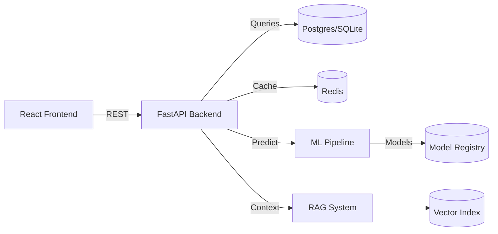
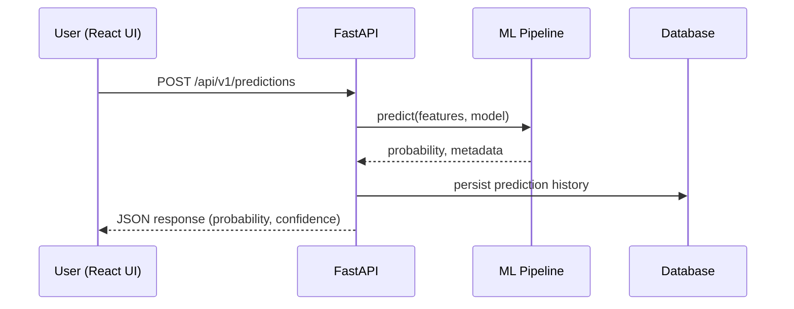

# NFL AI/ML Platform

A comprehensive platform for NFL analytics and touchdown prediction that combines production-ready backend services, modern frontend dashboards, and multiple deployment targets. The project demonstrates advanced ML pipelines, retrieval-augmented generation (RAG), real-time APIs, and cloud native tooling.

---

## Demo & Walkthrough

- **Interactive Storybook**: `npm run storybook` then open `http://localhost:6006`.
- **Live landing pages**: publish `frontend/landing/dist` to GitHub Pages (copy contents into your `gh-pages` branch).
- **Video overview**: [Watch the 3-minute walkthrough](https://www.example.com/demo-placeholder). Replace the URL with your Loom/YouTube link when ready.

## Project Structure

```
enhanced-nfl-platform/
├── backend/                 # FastAPI services, ML pipelines, and data loaders
│   ├── app/                 # Application package (API routes, core settings, services)
│   │   ├── api/
│   │   ├── core/
│   │   ├── models/
│   │   ├── schemas/
│   │   └── services/
│   ├── models/              # Persisted model artifacts
│   ├── advanced_ai_system.py
│   ├── advanced_ml_webapp.py
│   ├── database_production_app.py
│   ├── load_csv_to_mysql.py
│   ├── production_app.py
│   ├── sqlite_production_app.py
│   ├── robust_csv_loader.py
│   ├── requirements.txt
│   └── requirements-*.txt
├── frontend/                # React-based dashboards and static landing pages
│   ├── src/
│   │   ├── components/
│   │   ├── pages/
│   │   ├── services/
│   │   └── App.js
│   ├── package.json
│   ├── Dockerfile
│   └── *.html
├── scripts/                 # Utility scripts (e.g., setup.sh)
├── src/                     # Lightweight entry points for hosted platforms
│   ├── requirements.txt
│   └── start.py
├── data/                    # Placeholder for ingested datasets
├── docker-compose.yml       # Local orchestration of backend, frontend, and services
├── Dockerfile               # Root Docker image definition
├── requirements.txt         # Top-level Python dependencies
├── start.py                 # Launcher for consolidated services
├── DEPLOYMENT_GUIDE.md      # Comprehensive deployment walkthrough
├── deploy_*.sh              # Convenience scripts for target environments
├── render.yaml, heroku.yml, railway.json, etc.
└── ...                      # Additional configuration (nginx.conf, Procfile, env templates)
```

---

## Dependency Matrix

| Environment | How to install | Notes |
|-------------|----------------|-------|
| Backend Base | `pip install -r backend/requirements.txt` | Core API/ML stack used for local development, tests, and simple deployments |
| Backend Production | `pip install -r backend/requirements-production.txt` | Includes async Postgres drivers, embedding search, and OpenAI for full production deployments |
| Backend + LLaMA | `pip install -r backend/requirements-llama.txt` | Extends production stack with acceleration libraries for LLaMA-based RAG |
| Frontend | `cd frontend && npm install` | React dashboard; uses `package.json` in `frontend/` |

Backends running in managed environments (Render, Railway, Heroku, etc.) should specify the appropriate requirements file in their build configuration. Scripts and README snippets reference these same files to keep the workflow consistent.

---

## Deployment Matrix

| Target | Manifest / Script | Components | Required env vars (example) |
|--------|-------------------|------------|------------------------------|
| Docker Compose | `docker-compose.yml` | Backend API, React frontend, MySQL, Redis | `DATABASE_URL`, `MYSQL_USER`, `MYSQL_PASSWORD`, `MYSQL_DATABASE`, `REDIS_URL`, `OPENAI_API_KEY` |
| Render | `render.yaml`, `src/start.py` | Backend API | `DATABASE_URL`, `REDIS_URL`, `OPENAI_API_KEY`, `ALLOWED_HOSTS` |
| Railway | `railway.json`, `railway-deploy.md` | Backend API + managed Postgres/Redis | `DATABASE_URL`, `REDIS_URL`, `OPENAI_API_KEY`, `SECRET_KEY` |
| Heroku | `heroku.yml`, `Procfile`, `heroku-deploy.md` | Backend API | `DATABASE_URL`, `REDIS_URL`, `SECRET_KEY`, `OPENAI_API_KEY` |
| Netlify | `netlify.toml`, `frontend/` | React frontend | `REACT_APP_API_BASE_URL` (points to deployed API) |
| Vercel | `vercel.json` | React frontend | `NEXT_PUBLIC_API_BASE_URL` or `REACT_APP_API_BASE_URL` |
| Shell scripts | `deploy_*.sh`, `update_domain.sh` | Provider-specific automation | Load credentials from `.env` / provider secrets before running |

Copy `.env.template` to `.env` for each service, fill in provider-specific credentials, and configure the same values in your deployment dashboard (Render, Railway, Netlify, etc.). Never commit populated `.env` files.


---

## Architecture Diagram



## Sequence: Prediction Request



## Runbook

| Task | Command | Notes |
|------|---------|-------|
| Bootstrap backend | `pip install -r backend/requirements.txt` | Creates virtualenv dependencies |
| Launch local API | `uvicorn main:app --reload` (from `backend/`) | Uses SQLite + TEST_MODE toggles |
| Run backend tests | `make backend-test` | Enforces coverage ≥ 80% via pytest + coverage |
| Run frontend tests | `make frontend-test` | Executes React Testing Library suite |
| Launch Storybook | `make frontend-storybook` | Visual review of UI components |
| Generate landing pages | `python frontend/landing/build_landing_pages.py` | Outputs static pages to `frontend/landing/dist` |
| Serve landing pages | `python -m http.server --directory frontend/landing/dist 8080` | Visit `http://localhost:8080/enhanced.html` |
| Seed sample data | `make seed` | Loads CSV fixtures into SQLite |
| Security audit | `make audit` | Runs pip-audit and npm audit (non-blocking on moderate issues) |

**Key environment variables**

- `DATABASE_URL`: Override to point at Postgres/MySQL in production.
- `REDIS_URL`: Configure cache/queue endpoint.
- `OPENAI_API_KEY`, `VECTOR_DB_API_KEY`: Required for full RAG capabilities.
- `TEST_MODE`: Set to `true` inside CI to bypass heavyweight model initialisation.

**Failure modes to watch**

1. **Database unavailable** – API boots but returns 500; confirm `DATABASE_URL`, run migrations, or fall back to SQLite for demos.
2. **RAG dependencies missing** – Pinecone credentials absent; the assistant falls back to in-memory search, log warning emitted.
3. **Model cache missing** – Pipelines retrain on start; use `models/` artefacts or rerun training before production deploy.


## Key Features

- **Multiple ML Models**: XGBoost, TensorFlow, and PyTorch pipelines with ensemble orchestration.
- **RAG System**: Retrieval-augmented generation for natural language insights over NFL datasets.
- **Modern Frontend**: React 18 dashboard with analytics, scenario exploration, and live prediction views.
- **Production API**: FastAPI services with structured schemas, authentication hooks, and async support.
- **Cloud-Ready Deployments**: Dockerfiles, docker-compose, Procfile, and infrastructure manifests for popular platforms.
- **Data Engineering Utilities**: Robust CSV loaders, validation routines, and database setup scripts.

---

## Architecture Overview

```
┌──────────────────────┐      ┌──────────────────────┐      ┌──────────────────────┐
│ React Frontend        │      │ FastAPI Services      │      │ Data Stores           │
│ - Dashboards          │◄────►│ - REST/Graph APIs     │◄────►│ - PostgreSQL / MySQL  │
│ - Prediction Console  │      │ - ML Inference Layer  │      │ - Redis Cache         │
│ - RAG Chat Interface  │      │ - RAG Orchestrator    │      │ - Vector Index        │
└──────────────────────┘      └──────────────────────┘      └──────────────────────┘
                                      │
                             ┌──────────────────────┐
                             │ Model Registry       │
                             │ - Artifacts          │
                             │ - Metrics Tracking   │
                             └──────────────────────┘
```

---

## Quick Start

### Prerequisites

- Python 3.9+
- Node.js 16+
- PostgreSQL 13+ (or MySQL, depending on configuration)
- Docker (optional but recommended)

### Backend Setup

```bash
cd backend
python -m venv .venv
source .venv/bin/activate
pip install -r requirements.txt
uvicorn main:app --reload
```

### Frontend Setup

```bash
cd frontend
npm install
npm start
```

### Docker Compose

```bash
docker-compose up --build
```

This starts the complete stack (API, frontend, database, supporting services) using the configuration defined in `docker-compose.yml`.

---

## API Highlights

- `GET /api/players` — Retrieve player metadata for downstream analytics.
- `POST /api/predictions` — Generate touchdown probability predictions.
- `GET /api/analytics` — Aggregate insights on historical performance.
- `POST /api/rag/query` — Submit natural language questions to the RAG subsystem.

---

## Machine Learning & RAG Components

---

## Security Hardening

- **Secret management**: copy `.env.template` to `.env`, store values in your deployment platform (Render/Railway/Heroku) as managed secrets. Never commit populated env files.
- **CORS policies**: update `settings.ALLOWED_HOSTS` in `app/core/config.py` before exposing the API publicly.
- **Authentication**: leverage `app/models/database.User` and extend FastAPI routers with JWT middleware (see `python-jose` dependency).
- **Rate limiting**: front the API with an ingress (nginx, Cloudflare) and enable request quotas for `/api/v1/rag/*`.
- **Auditing**: run `make audit` locally or in CI to execute `pip-audit` and `npm audit`. Address high/critical findings before release.
- **Transport security**: terminate TLS at your load balancer (Render, Railway, or AWS ALB) and enforce HTTPS-only traffic.

- **Model Zoo**: Gradient boosting, deep learning, and sequence models tuned for quarterback performance.
- **Feature Engineering**: Rolling averages, situational stats, contextual game features.
- **Explainability**: SHAP-based explainers and feature importance dashboards.
- **Knowledge Retrieval**: Embedding generators, vector search, and contextual response synthesis.

---

## DevOps and Deployment

- **Containerization**: Consistent Dockerfiles for backend and frontend services.
- **Multi-Platform Deployment**: Scripts and manifests for Render, Railway, Heroku, Netlify, Vercel, and custom servers.
- **CI/CD**: GitHub Actions workflows under `.github/workflows`.
- **Configuration Management**: Environment templates (`env.example`), Nginx proxy settings, and infrastructure automation scripts.

---

## Performance Targets

- Model accuracy: 90%+ on validation splits with F1 emphasis on touchdown outcomes.
- API latency: Sub-200 ms median inference time under typical load.
- Horizontal scalability through container orchestration and caching layers.

---

## Licensing

Released under the MIT License. Refer to `LICENSE` for full terms.

---

## Author

Shelton Bumhe — AI/ML Engineer  
[LinkedIn](https://linkedin.com/in/sheltonbumhe) · [Portfolio](https://sheltonbumhe.com)
